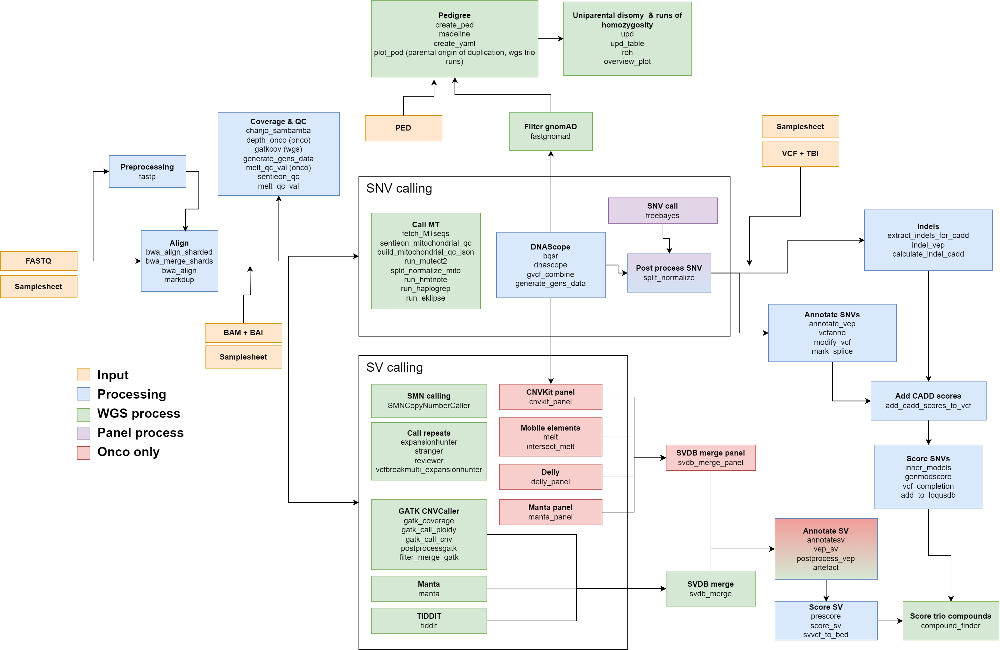

# README

## Table of content

* [Pipeline overview](#pipeline-overview)
* [Running the pipeline](docs/running_the_pipeline.md)
* Inputs
    * [Input files](docs/input_files.md)
    * [Annotation files](docs/annotation_files.md)
    * [Containers](docs/input_containers.md)
    * [Sentieon license](docs/sentieon_license.md)
* [Outputs](docs/outputs.md)
* [How to deploy](docs/how_to_deploy.md)
* [List of used software](docs/list_of_all_used_software.md)
* [Misc documents](docs/misc_docs.md)

## Pipeline overview

The constitutional wgs pipeline is a versatile workflow used in both genome sequencing and panels. It is implemented in the [Nextflow](https://www.nextflow.io/) workflow-language and designed to run in a computational cluster environment, using Singularity containers to manage software dependencies.

The output is immediately importable into the software [Scout](https://github.com/Clinical-Genomics/scout), an open-source software for identifying variants with clinical significance. 

In order to run it, you will need to have a [Sentieon license](https://support.sentieon.com/appnotes/license_server/).

### A typical workflow

1. Preprocess, align and deduplicate reads
2. Calculate QC and coverage information 
3. Perform SNV and SV calling
4. Subset the calls by intersecting with regions of interest
5. Generate annotations for the subset of calls
6. Calculate scores for clinical significance

### Further configurations

* When run in WGS-mode, mitochondrial analysis is performed
* For trios, uniparental disomy and runs of homozygosity are analysed
* When running panels, a different set of structural variant callers adapted to panel data are run
* For onco-samples, an additional SNV-caller "freebayes" is used.

If you run into any issues using this pipeline, [open an issue in the GitHub repository](https://github.com/Clinical-Genomics-Lund/nextflow_wgs/issues).

Illustration of the pipeline, its steps and processes.

