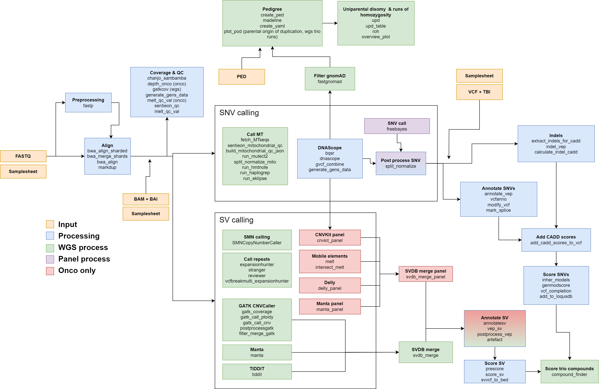

The wgs pipeline is used both to process full genome sequencing, exomes and panels.

It is designed to work together with Scout, a downstream software for identifying variants with clinical significance.

It can run in either single or trio mode. The running mode is decided by the number of entries in the input sample sheet.

It can also handle specific panels - myeloid and moby CF.

The pipeline is written in Nextflow, DSL version 1. DSL 1 is deprecated and not supported since Nextflow version 21. This pipeline is still in production in CMD, Lund, but is expected to either be rewritten to DSL 2 or replaced with the nf-core raredisease pipeline during 2024.

The pipeline uses singularity containers to allow executing software with various dependencies without the need to install these on the server. It is designed to work with the resource management system SLURM, and will start one SLURM process per process.

FIXME: Can I link to the .doc documentation from here? Is it publicly accessible?

Then the table of content:

* [Running the pipeline](2_running_the_pipeline.md)
* [How to deploy](3_how_to_deploy.md)
* [Inputs](4_0_inputs.md)
    * [Input files](4_1_input_files.md)
    * [Annotation files](4_2_annotation_files.md)
    * [Containers](4_3_inputs_containers.md)
    * [Sentieon license](4_4_inputs_sentieon_license.md)
* [Outputs](5_outputs.md)
* [List of used software](6_list_of_all_used_software.md)

Overview of processes and impact of settings and profiles.

