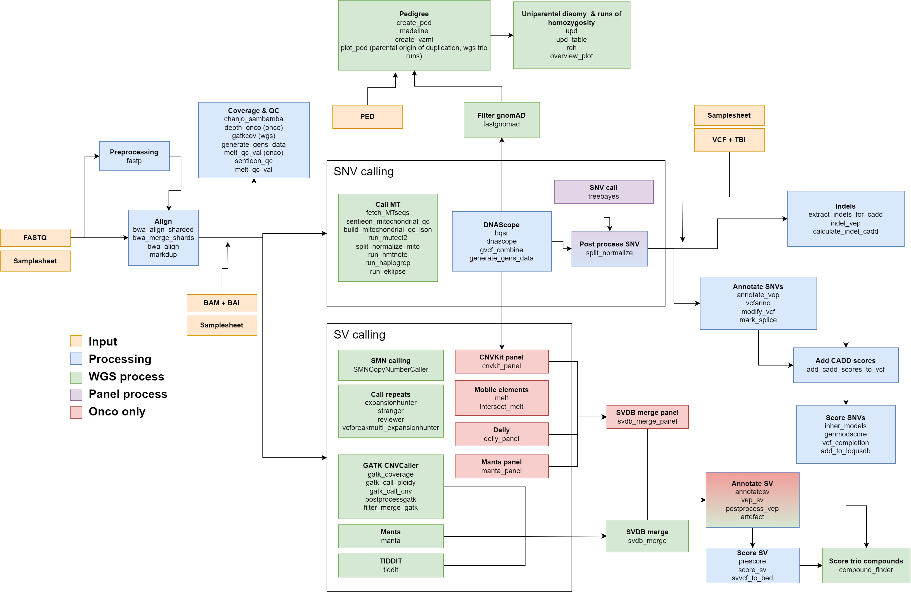

The constitutional wgs pipeline is a versatile workflow used in both genome sequencing and panels. It is implemented in the [Nextflow](https://www.nextflow.io/) workflow-language and designed to run in a computational cluster environment with Singularity containers to contain software dependencies to individual processes.

The is designed to be immediately importable into the software [Scout](https://github.com/Clinical-Genomics/scout), an open source software for identifying variants with clinical significance. 

It can currently handle whole genome sequencing samples (both single and trios), as well as onco-, myeloid and mody-cf panels and exome samples.

To use the pipeline you need to have access to a Sentieon license.

A typical workflow consists of the following steps:

1. Optionally preprocess, align and dedup reads (bwa-mem)
2. Calculate QC and coverage information 
3. Perform SNV and SV calling using separate workflows
4. Generate annotations
5. Calculate "severity" scores and merge variants

Additional configurable analyses:

* When ran in WGS-mode, it will carry out additional mitochondrial analysis.
* For trios, uniparental disomy and runs of homozygosity are analysed.
* When running panels, a different set of structural variant callers are run.
* For onco-samples, an additional SNV-caller "freebayes" is used.

If you run into any issues using this pipeline, [open an issue in the GitHub repository](https://github.com/Clinical-Genomics-Lund/nextflow_wgs/issues).

Illustration of the pipeline, its steps and processes.

### Table of content

* [Running the pipeline](running_the_pipeline.md)
* [Inputs](4_0_inputs.md)
    * [Input files](4_1_input_files.md)
    * [Annotation files](4_2_annotation_files.md)
    * [Containers](4_3_inputs_containers.md)
    * [Sentieon license](4_4_inputs_sentieon_license.md)
* [Outputs](5_outputs.md)
* [How to deploy](3_how_to_deploy.md)
* [List of used software](6_list_of_all_used_software.md)

