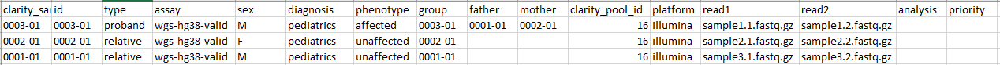

# Input files

The main input file is a samplesheet specifying one row per sample specifying all needed IDs, paths and meta-data.
The CSV file expected comma-delimited file containing a fixed set of header fields. These fields can be given in any order.

An [example CSV](https://github.com/Clinical-Genomics-Lund/nextflow_wgs/blob/master/docs/demo/1999-20.csv) is shown below:

If running a single sample, then a single data-row is expected. If running a trio, then one line per each sample is expected.

## Required fields

### ID headers

* **id**: ID of sample
* **clarity_sample_id**: Used for scout-db matches to clarity-lims. Can be the same as **id**
* **group**: Group/family name. Changed when samples are rerun. If you have a trio, then each should have the same group name.
* **mother**: ID of mother. Empty if single or not proband.
* **father**: ID of father. Empty if single or not proband.

### Sample-information

* **type**: "proband" or "relative"
* **sex**: "F" or "M"
* **phenotype**: "affected" or "unaffected"
* **diagnosis**: Chosen gene-panel for sample
* **read1**: FASTQ read 1*
* **read2**: FASTQ read 2*
* **assay**: What analysis, automated choice through `start_nextflow_analysis.pl -profile wgs` and choses right institute in scout for sample
* **analysis**: Sub-analysis, i.e. `wgsdev` would put samples in validation institute instead of clinical

\* **read1** and **read2** can also be supplemented `bam` and `bqsr` for samples to bypass alignment. Might also work for vcfs (vcf + idx) for SNV annotation.

## Other useful fields

* **priority**: Changes priority of sample in slurm. Default is defined in `nextflow.config`.

